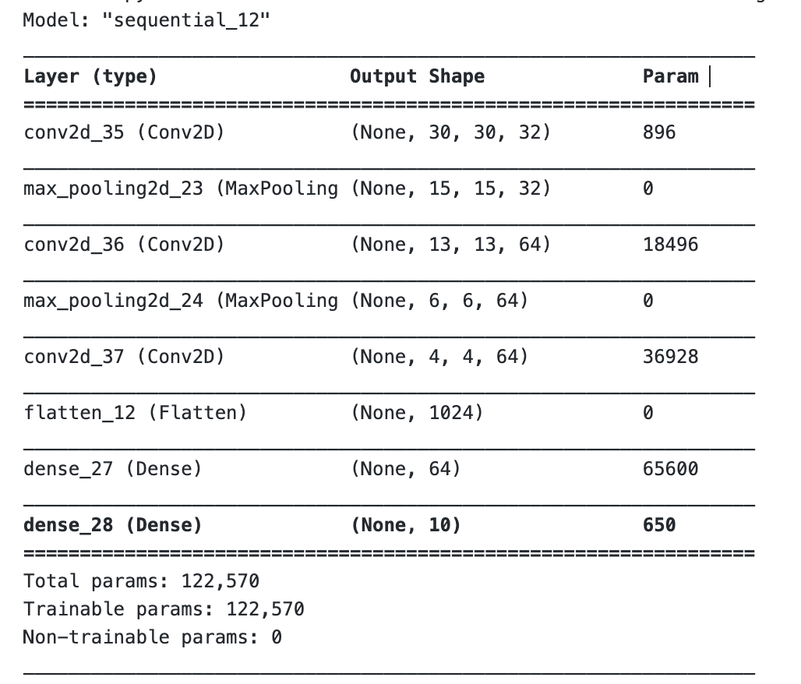

# Deep-Learning
This repository is used to demonstrate deep learning algorithm (Convolutional Neural Network) using TensorFlow. 
## Abstract
The goal of this project is to create a Deep Learning model. The dataset has 5 types of ships which are {'Cargo': 1, 'Military': 2, 'Carrier': 3, 'Cruise': 4, 'Tankers': 5}. Convolutional Neural Network (CNN) is trained with the images of various types of ships using a 60% of the data and validate simulataneously against 20% of the data and finally test the training with the remaining 20% of the data. The CNN is adjusted with various hyperparameters like using different activation functions, loss functions, changing the epochs, using various initialisers, changing network size and layers and finally obtaining the best accurate version of the CNN for the data. The programming is done in TensorFlow language by Google and loss and accuracy plot indicate how good or bad the network is trained aganist the data.
### PART B - Changing Activations
Activations are changed, keeping all other hyperparameters constant for differentiation

### PART C - Changing Cost Function
Cost Functions are changed, keeping all other hyperparameters constant

### PART D - Changing Epochs
Epochs are changed, keeping all other hyperparameters constant

### PART E - Changing Gradients
Gradients are changed, keeping all other hyperparameters constant

### PART F - Changing Intialization
Initializations are changed, keeping all other hyperparameters constant

### PART G - Changing Hyperparameters
The network architectures, no of layers, epochs and filter sizes were all changed during the course of the earlier training to understand the results and decide which is values of hyperoaramets are functioning better?

## The CNN model:
Parameters:

- Activation function = ReLU

- Loss function = SparseCategoricalCrossentropy()

- Optimizer = ADAM

## MODEL SUMMARY - MODEL 1
In the Jupyter Notebook furthers models can be found. Illustrating one model results below.

## The model is trained for 15 epochs and the maximum validation accuracy achieved is 65.83%
